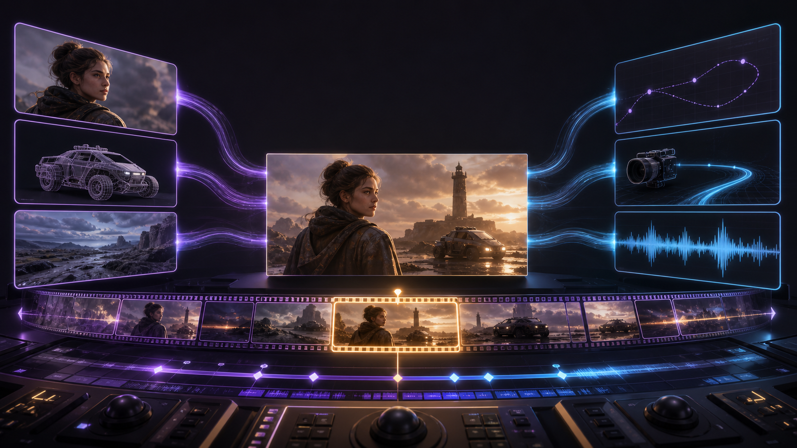
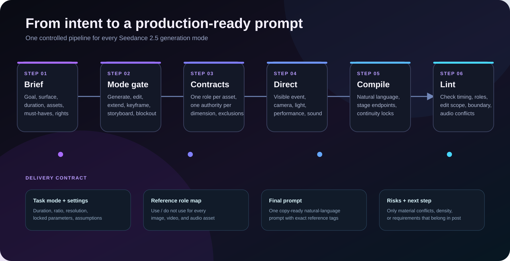
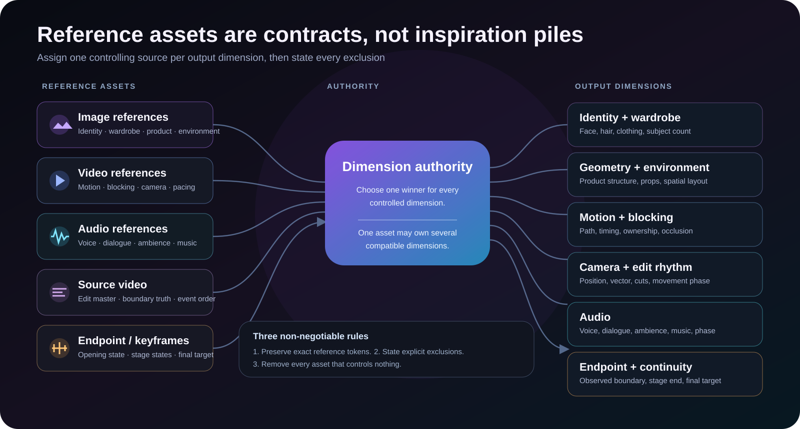

<p align="center">
  
</p>

<h1 align="center">Seedance 2.5 Director</h1>

<p align="center">
  <strong>导演场景，绑定参考，延续状态。</strong><br>
  将创意、脚本和多模态素材转换为可直接用于生产的 Seedance 2.5 提示词的 Agent Skill。
</p>

<p align="center">
  
  
  
  
</p>

<p align="center">
  <a href="README.md">English</a> ·
  <strong>简体中文</strong> ·
  <a href="README.ja.md">日本語</a>
</p>

<p align="center">
  <a href="#为什么需要这个仓库">为什么</a> ·
  <a href="#这个-skill-能做什么">能力</a> ·
  <a href="#从这里开始">开始</a> ·
  <a href="#安装">安装</a> ·
  <a href="#使用-skill">使用</a> ·
  <a href="#提示词检查器">检查</a> ·
  <a href="#官方来源边界">来源</a>
</p>

---

## 为什么需要这个仓库

Seedance 2.5 可以接收文本、图像、视频和音频，但更多输入并不会自动带来更多控制。复杂生成通常因为以下结构性问题而失败：

- 多个参考素材争夺同一个输出维度；
- 角色、道具或对白没有绑定到明确的主体；
- 一个镜头包含的事件超过时长所能承载的密度；
- 运镜遮挡了决定性动作；
- 编辑任务没有指定唯一母版视频和唯一修改范围；
- 扩展任务沿用计划中的结尾，而不是已经生成的真实边界；
- 一次重试修改太多变量，无法判断究竟是什么解决了问题。

本仓库将这些反复出现的制作问题整理为一个可复用的 Agent Skill。它不会只是把简短创意扩写成更长的形容词列表，而是先确定每份素材控制什么，再导演可见动作、摄影机、灯光、表演、声音、连续性和最终状态。

最终得到的提示词更容易生成、审片、修复和交接给其他协作者。

## 这个 Skill 能做什么

`seedance-25` 可以帮助 Agent：

- 根据创作需求生成新的 Seedance 2.5 提示词；
- 修改、压缩或翻译现有提示词；
- 在写提示词之前选择正确的生成路径；
- 为图像、视频和音频参考分配明确角色；
- 规划标准生成、分阶段生成和多片段长片制作；
- 编写视频编辑、扩展、端点、分镜、白模和转场提示词；
- 保持身份、几何结构、道具归属、空间关系、摄影机运动阶段和音频连续性；
- 诊断失败结果，并在保留、后期修复、局部编辑、重新抽样或重写之间作出判断；
- 每次重试只修改一个变量；
- 在生成前检查提示词结构。

它有意区分两类知识：

1. **已验证的平台事实**——来自 Dreamina Seedance 2.5 官方资料的数量、时长、锁定设置和工作流名称。
2. **制作方法**——可复用的导演、参考契约、连续性和修复方法。

这种分离可以防止旧版 Seedance 2.0 限制或未经验证的第三方说法被误当成“2.5 事实”。

## Seedance 2.5 一览

下列数值来自[官方来源边界](#官方来源边界)中列出的 Dreamina Seedance 2.5 官方指南，并于 2026 年 8 月 3 日完成核验。它们适用于官方文档所描述的 Dreamina 界面，不会自动适用于所有 API 或第三方产品。

| 能力 | Dreamina 2.5 官方说明 |
|---|---|
| 参考素材总数 | 最多 50 份 |
| 图像 | 最多 30 张；每张不超过 4K |
| 视频参考 | 最多 10 条；合计不超过 30 秒 |
| 音频参考 | 最多 10 条；合计不超过 30 秒 |
| 标准生成 | 4–30 秒 |
| 单次扩展 | 4–30 秒 |
| 嵌套扩展 | 最终视频最长 60 秒 |
| 官方列出的输出分辨率 | 480p 和 720p |

对于通用或未知的 Seedance 2.5 接入平台，单次直接生成不得超过 30 秒。更长的作品应规划为多个独立生成的片段。上限不是目标值：Skill 会移除没有控制职责的素材，并只选择当前场景真正需要的参考。

当前 API 字段、模型 ID、价格、配额、地区、账户、发布状态和不同界面的可用性被有意排除在冻结知识边界之外。使用时必须重新查阅最新官方文档。

## 工作模型

<p align="center">
  
</p>

每个请求都经过同一条受控流程：

1. **需求**——确定目标、使用界面、时长、素材、必须满足的要求和素材权利。
2. **模式选择**——选择生成、编辑、扩展、端点、分镜、白模或转场逻辑。
3. **参考契约**——为每份参考分配角色、控制权和排除项。
4. **导演**——定义可见事件、摄影机、灯光、表演、声音和结束状态。
5. **编译**——生成一条可直接复制的自然语言提示词，并保留精确的参考 token。
6. **检查**——在消耗生成次数之前发现结构风险。

Skill 最终交付一份紧凑的制作契约：设置、参考角色映射、最终提示词，以及真正影响成功率的风险或下一步。

## 从这里开始

根据制作意图选择路径，而不是根据需求里出现了多少形容词来选择。

| 任务 | 使用路径 | 首要保护 |
|---|---|---|
| 一个明确的独立镜头 | 基础生成 | 一个主要可见事件和一个主要运镜 |
| 图像、视频或音频参考 | 多模态参考 | 每份素材一个明确角色和排除项 |
| 30 秒内包含多个事件 | 分阶段生成 | 每个阶段一个状态变化和一个可见结束状态 |
| 超过 30 秒 | 多片段制作 | 拆分为多个单独生成且每段不超过 30 秒的片段 |
| 修改现有视频 | 视频编辑 | 唯一母版、唯一编辑范围和保留清单 |
| 继续已经接受的视频 | 正向或反向扩展 | 以观察到的边界帧作为连续性事实 |
| 两个端点 | 首尾帧生成 | 分别定义端点，并用连续动作连接 |
| 多个有序状态 | 多关键帧 | 明确每个锚点的顺序和到达状态 |
| 分镜网格或草图 | 分镜参考 | 阅读顺序、镜头角色和线稿排除项 |
| 3D 灰模 | 粗白模或精白模 | 区分运动骨架与完整几何结构 |
| 使用多张图快速成片 | 一键成片 | 素材顺序、运动量、剪辑节奏、包装和声音 |
| 连接两个片段 | 无缝转场 | 触发动作、覆盖过程、到达状态和音频桥接 |
| 失败或部分正确的结果 | 诊断并重试 | 先作出判断，再只修改一个变量 |

Skill 只读取与当前路径相匹配的参考章节，不会把所有模板一次性塞进每个请求。

## 参考素材是契约

<p align="center">
  
</p>

每份素材的参考契约都回答两个问题：

1. 这份素材可以控制什么？
2. 哪些内容不得从它迁移？

示例：

```text
@Image 1 defines Character A's facial features, hairstyle, and wardrobe.
Do not use its background, composition, pose, or lighting.

@Video 1 controls only Character A's motion path, timing, and camera rhythm.
Do not transfer the performer, wardrobe, room, logos, or source audio.

@Audio 1 controls only Character A's voice, delivery, and the quoted line.
Do not add background music.
```

三条不可妥协的规则：

- 精确保留平台插入的参考 token；
- 为每个输出维度选择一个控制来源；
- 删除所有不控制任何内容的素材。

当多张图展示同一个主体时，提示词会明确说明这一点并锁定输出数量。当多个来源冲突时，Skill 会选择一个胜出者，而不是要求模型“融合全部内容”。

## 导演式提示词架构

最终提示词按以下顺序编译：

```text
Reference roles
→ Generation goal
→ Subject and primary event
→ Scene or stage progression
→ Camera
→ Light and visual treatment
→ Audio
→ Continuity and exclusions
```

该架构优先使用可观察的描述：

- 使用“A hard window key from camera left cuts across the face”，而不是“beautiful lighting”。
- 使用“The dolly starts waist-high, tracks the runner from the left, then stops on the closed gate”，而不是“dynamic camera”。
- 使用“Her gaze drops, jaw tightens, right hand releases the key, and breathing becomes shallow”，而不是“very emotional”。
- 使用“The glass fractures from the impact point, fragments catch the desk light, then settle on the floor”，而不是“epic destruction”。

每个动作都应包含初始状态、触发、变化、结果和可见结束状态。精确秒数只用于关键交接、进入、离开、转场或节拍；普通叙事默认按阶段组织。

## 示例：多模态场景

### 制作需求

```text
Goal: a tense 12-second product reveal in a rain-darkened workshop.
References: one product image, one camera-motion clip, one ambience recording.
Must preserve: product geometry, engraved mark, and subject count.
Output: 16:9, 720p, 12 seconds.
```

### 参考角色映射

```text
@Image 1 — product geometry, material, and engraved mark only;
             do not use its white background or studio reflections.
@Video 1 — camera path and acceleration only;
             do not transfer its room, performer, object, color grade, or audio.
@Audio 1 — rain ambience and distant metal resonance only;
             do not add speech or music.
```

### 最终提示词

```text
@Image 1 defines the exact geometry, dark brushed metal, and engraved mark of one product. Do not use its white background, studio composition, or reflections. @Video 1 controls only the camera path and acceleration; do not transfer its room, performer, object, color grade, or sound. @Audio 1 controls only rain ambience and distant metal resonance; do not add dialogue or music.

Generate a 12-second product reveal in a rain-darkened mechanical workshop. The frame begins close on a wet steel workbench with the product mostly hidden beneath a charcoal cloth. A gloved hand enters from frame right and pulls the cloth away in one continuous movement. Water beads remain on the product surface; the engraved mark becomes fully visible as the cloth clears it. End state: exactly one product stands unobstructed at the center of the bench, the hand has exited frame right, and the cloth rests at the far edge.

Camera: inherit only the path and acceleration from @Video 1, beginning at bench height, sliding left around the product, and settling in a centered three-quarter close-up. Light: a cold overhead work lamp creates a narrow rim on the wet metal while one warm furnace reflection moves across the side during the camera slide. Sound: preserve @Audio 1's rain and distant metal resonance, add one soft cloth drag and one restrained metal settle, with no speech and no music.

Maintain exactly one product, its geometry, engraved mark, material, bench position, and screen direction throughout. Do not add text, logos, extra hands, tools crossing the product, or additional products.
```

如果当前界面提供独立设置控件，生成参数应放在提示词之外。

## 模式专用保护

### 视频编辑

编辑提示词必须声明：

- 一个源视频作为唯一编辑母版；
- 一个需要修改的对象、区域、时间范围或音频类别；
- 相关情况下的目标数量和替换继承关系；
- 编辑范围之外所有必须保持不变的内容。

### 正向和反向扩展

已经接受的视频优先于原始计划。提示词从观察到的边界状态开始：姿势、视线、道具归属、空间、摄影机位置与运动阶段、未完成的主体运动和音频阶段。反向扩展还会防止角色、道具或效果在源视频出现之前提前出现。

### 首尾帧和关键帧

每个端点都需要独立定义。补充参考可以控制身份、服装或几何结构，但不得覆盖端点构图。多关键帧定义的是有序状态，而不是逐帧复现。

### 分镜和白模

分镜控制镜头顺序和近似构图，同时排除线稿风格、文字标签和占位角色。粗白模控制时间和空间骨架；精白模可以控制完整几何结构，再重新渲染材质、角色、环境和风格。

### 无缝转场

转场需要物理触发或形变过程、桥接期间的连续运动、明确的到达构图和音频过渡。只写“让转场无缝”并不足够。

## 输出契约

对于普通请求，Skill 返回：

1. **任务模式与生成设置**——时长、宽高比、分辨率、锁定值和明确披露的假设。
2. **参考角色映射**——每份素材使用什么，以及不得使用什么。
3. **最终提示词**——一个可直接复制的代码块，并保留精确参考 token。
4. **风险或下一步**——一至三个真正影响成功率的问题。

对于诊断请求，它返回：

```text
Verdict → Evidence → One changed variable → Repaired prompt
```

如果主要目标已经成功，Skill 可以建议保留结果、后期修复或只编辑一个图层，而不是重新生成整个镜头。

## 提示词检查器

内置检查器执行确定性的结构检查。它不会预测视觉质量、调用 Seedance，也不会保证平台正确绑定参考素材。

检查提示词文件：

```bash
python3 seedance-25/scripts/lint_prompt.py prompt.txt --mode auto --duration 30
```

通过标准输入传入草稿：

```bash
printf '%s\n' '@Video 1 is the source. Extend forward from the observed last frame...' \
  | python3 seedance-25/scripts/lint_prompt.py - --mode extend
```

输出机器可读结果：

```bash
python3 seedance-25/scripts/lint_prompt.py prompt.txt --mode edit --json
```

支持的显式模式包括 `base`、`reference`、`long`、`edit`、`extend`、`first-last`、`keyframes`、`storyboard`、`blockout` 和 `transition`。`auto` 会推断最可能的模式。

检查器可以发现以下风险：

- 计划中的单次直接生成时长超过 30 秒；
- 无效、重叠、存在间隔或超出计划时长的时间范围；
- 多份参考没有角色或排除项；
- 编辑任务没有唯一母版、窄范围或保留清单；
- 扩展任务没有观察到的边界状态或连续性锁定；
- 首尾帧定义不完整；
- 关键帧没有明确顺序；
- 分镜没有阅读顺序或线稿排除项；
- 白模没有分类或缺少继承规则；
- 转场缺少两个片段、触发动作或到达状态；
- 长提示词缺少阶段或可见结束状态；
- 通用风格强化词堆叠；
- 相互矛盾的音频指令。

错误会产生非零退出码。警告和信息提示用于人工复核。

运行内置自测：

```bash
python3 seedance-25/scripts/lint_prompt.py --self-test
```

## 安装

### 方式 A——Codex 个人 Skill

```bash
git clone git@github.com:sjinn-ai/seedance2.5-skills.git
mkdir -p "${CODEX_HOME:-$HOME/.codex}/skills"
cp -R seedance2.5-skills/seedance-25 "${CODEX_HOME:-$HOME/.codex}/skills/seedance-25"
```

如果客户端没有自动检测到新 Skill，请在安装后重新启动或刷新客户端。

### 方式 B——项目级 Skill

在需要使用该 Skill 的项目中执行：

```bash
mkdir -p .agents/skills
cp -R /path/to/seedance2.5-skills/seedance-25 .agents/skills/seedance-25
```

如果你的 Agent 客户端使用不同目录，请采用该客户端要求的位置。运行时 Skill 完全包含在 `seedance-25/` 中；仓库根目录的 `assets/` 仅用于 README。

## 使用 Skill

通过名称调用，并提供需求和已有素材说明：

```text
$seedance-25 Create a 30-second Seedance 2.5 prompt for a two-character chase.
Use @Image 1 for Character A's identity, @Image 2 for Character B's identity,
@Video 1 only for the motorcycle motion, and @Audio 1 for rain ambience.
Keep the red bag with Character A throughout. End on both characters under the station clock.
```

诊断示例：

```text
$seedance-25 Diagnose this failed extension. The new segment duplicates the actor,
repeats the door opening, and reverses the camera direction. Return one changed
variable and a conservative repaired prompt.
```

Skill 会使用用户要求的输出语言进行回答，但随 Skill 分发的指令和参考文档全部保持英文。

## 仓库结构

```text
seedance2.5-skills/
├── README.md
├── README.zh-CN.md
├── README.ja.md
├── assets/
│   ├── reference-role-map.svg
│   ├── seedance-25-hero.png
│   └── skill-workflow.svg
└── seedance-25/
    ├── SKILL.md
    ├── agents/
    │   └── openai.yaml
    ├── references/
    │   ├── capabilities-and-limits.md
    │   ├── quality-and-repair.md
    │   └── task-patterns.md
    └── scripts/
        └── lint_prompt.py
```

### Skill 文件映射

| 文件 | 职责 |
|---|---|
| `seedance-25/SKILL.md` | 入口、事实边界、模式路由、导演工作流、输出契约和安全要求 |
| `capabilities-and-limits.md` | 已验证的 Dreamina 2.5 数值、任务专用锁定设置、限制和事实声明规则 |
| `task-patterns.md` | 生成、参考、长视频、编辑、扩展、端点、分镜、白模、转场、音频、表演和摄影机的模式专用提示词结构 |
| `quality-and-repair.md` | 结果分流、单变量重试、症状诊断、连续性修复和生成记录 |
| `lint_prompt.py` | 面向英文和中文提示词的常见结构风险启发式检查 |
| `agents/openai.yaml` | 面向 Agent 的显示名称、说明和默认调用提示词 |

## 验证

安装 Codex `skill-creator` 后，可以验证 Skill 结构：

```bash
python3 "${CODEX_HOME:-$HOME/.codex}/skills/.system/skill-creator/scripts/quick_validate.py" seedance-25
```

运行检查器回归测试：

```bash
python3 seedance-25/scripts/lint_prompt.py --self-test
```

仓库设计为无需联网即可完成验证。但在声明 API、价格、地区、配额或可用性等时效性信息之前，仍需在线查阅最新官方资料。

## 当前状态与边界

| 组件 | 状态 | 边界 |
|---|---|---|
| 核心 Skill 工作流 | 可用 | 生成提示词和制作计划，不调用视频生成服务 |
| 参考知识库 | 可用 | 基于下方说明的官方指南和制作方法 |
| 提示词检查器 | 可用，启发式 | 检测结构风险，不评价美学质量或模型服从程度 |
| README 配图 | 可用 | 仅用于解释，不是 Seedance 生成结果样片 |
| API 集成 | 未包含 | 不同界面的 API 需要单独进行实时验证 |

本仓库不声称拥有 Seedance 2.5 的访问权限，不保证生成结果，也不会把客户端上传的媒体视为权利证明。真人肖像、声音、品牌、音乐和受保护角色只应在获得适当授权时使用，否则应替换为原创等价物。

## 官方来源边界

本仓库中的 Seedance 2.5 能力事实来自：

- [Dreamina Seedance 2.5 User Guide](https://bytedance.larkoffice.com/wiki/NjnWwvf4BiFYFLk2RzrcEgaunGf)
- [Dreamina Seedance 2.5 Prompt Guide](https://bytedance.larkoffice.com/docx/A88jd0B47oAd8zxWp5ycZFMfnxh)

2026 年 8 月 3 日，官方页面已通过浏览器与用户提供的复制文本逐项比对。文本目录和正文完整；复制材料没有包含嵌入图片、完成视频和部分视觉对比，因此本仓库不会声称已经视觉核验这些示例结果。

工作流设计也参考了采用 MIT 许可证的 [Emily2040/seedance-2.0](https://github.com/Emily2040/seedance-2.0)，尤其是模式路由、参考契约、连续性事实和单变量重试方法。只有上述 2.5 官方来源用于 Seedance 2.5 能力与数值声明。

## 设计标准

由该 Skill 生成的优秀提示词应当具备：

- **绑定明确**——每份重要素材、每个角色、产品、道具和台词都有明确归属。
- **可观察**——动作、情绪、灯光、声音和端点可以直接看到或听到。
- **连续**——身份、几何结构、归属、空间、画面方向、摄影机阶段和音频状态保持一致。
- **范围清晰**——编辑只改一个层；扩展继承一个真实边界；每个阶段只有一个主要状态变化。
- **可复核**——团队能够判断什么成功、什么失败，以及下一次只应修改哪个变量。
- **事实可靠**——平台事实保持在已验证官方证据和当前使用界面的范围内。

核心原则很简单：

> 参考素材定义控制权，导演指令定义变化，已接受的视频定义事实。

## 致谢

- Dreamina Seedance 2.5 官方文档提供能力与工作流事实。
- [Emily2040/seedance-2.0](https://github.com/Emily2040/seedance-2.0) 提供高质量的开源参考架构，为本仓库的组织方式和制作推理提供了启发。
